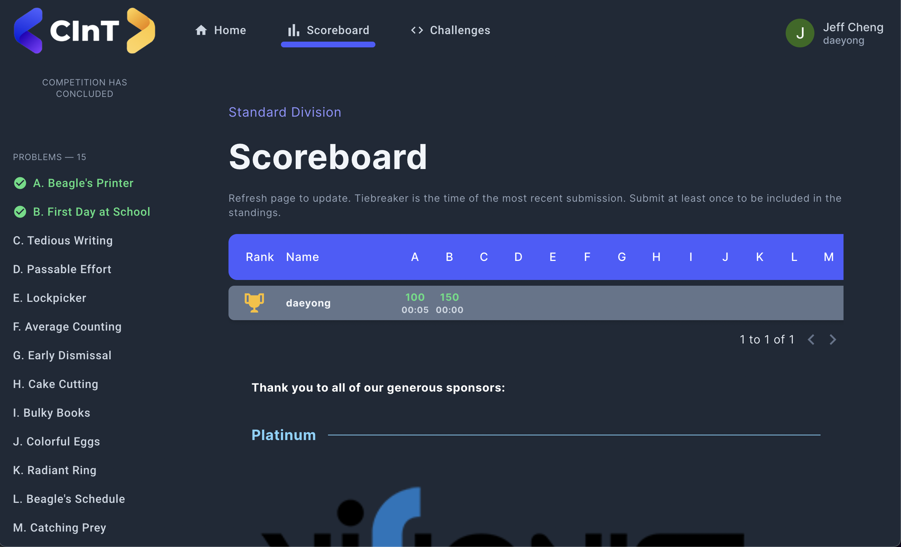

# Live Competition Server
A live competition server for coding competitions. Relies heavily on the [Codeforces](https://codeforces.com) platform. Used for the [Centennial Informatics Tournament (CInT)](https://cint.info) on May 26, 2022.

## Problem Page
Uses a Codeforces-style problem statement with MathJax rendering for equations and math symbols.

## Submit Solution
Paste code into the text box to submit. Supports C++, Java, and Python submissions.

## Submission Verdict
Receive live submission results for you and your team's submissions in both the problem page and sidebar.

## Contest Scoreboard
Live scoreboard updates throughout the contest with points and time of submission. Time of submission, like Codeforces, is measured in minutes and hours after the start of the competition. Time of submission is the only tiebreaker used.

### Frontend Development
See [frontend/README.md](frontend/README.md)

### Backend Development
See [backend/README.md](backend/README.md)

### Installation
Follow the [backend setup steps](backend/README.md) to install and setup the server.  

### Usage
http://localhost:3000 will take you to a contest page for the Codeforces gym contest specified in [backend/configs/config.go](backend/configs/config.go). Make sure you change the contest to one that your account has access to (any public gym or a private gym that you create/are invited to).
- ex. Setting config.ContestId to "102787" should show Codeforces gym contest https://codeforces.com/gym/102787
- Codeforces requires contest participation to start mashups, so it is recommended to start the mashup on a regular account and invite the service account
  - Note: in order to allow the same code to be submitted twice, you must click "Enable Manager Mode" in the contest from the service account. This might be automated in the future.

Note - changes to [backend/configs/config.go](backend/configs/config.go) might break the CI/CD pipeline, so leave them out of a pull request.
